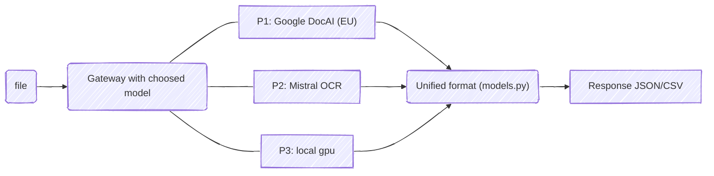

### OCR based, GDPR compliant receipts processing tool

Idea behind this project is to use a fusion of propietary but RODO compliant OCR solutions & local GPU powered image-to-text model.

From architecture side, k3s with embedded etcd will be good fit

work in progress, stay tuned

